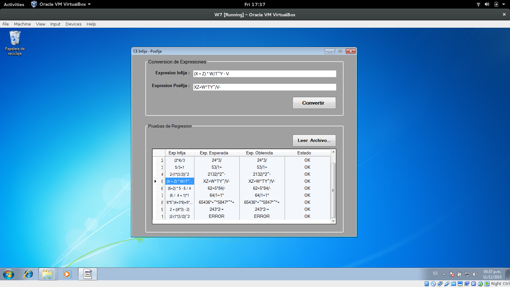

## Conversión de Expresiones - Infija a Posfija

Este programa consiste en el desarrollo de un algoritmo para convertir una expresión de infija a posfija. El algoritmo utliza un Pila como estructura de datos dinámica para llevar a cabo la conversión.

