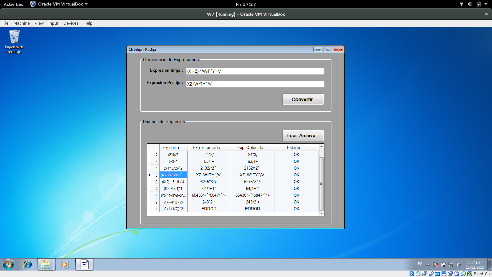

# Compilers-Lexical-Analysis

Compiler Algorithms to implement a Lexical Analysis.

#### Infija to Postfija Converstion

#### Reverse Polaca Convertion

#### Regular Grammar Algorithm

#### Thompson Algorithm

#### Subset Construction Algorithm

#### Minimization Algorithm

