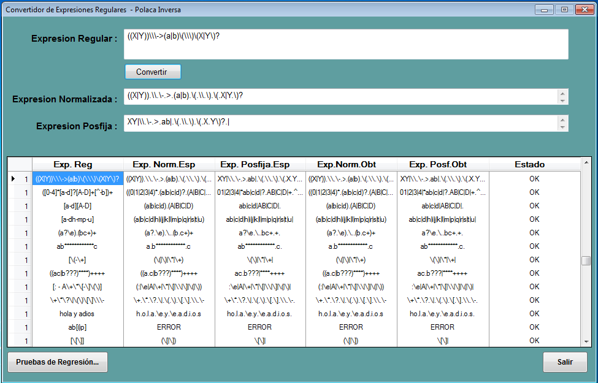

#Conversión de Expresiones Regulares a Polaca Inversa

Este programa consiste en convertir una expresión regular a su expresión posfija correspondiente así como obtener su expresión normalizada, estas expresiones resultantes serán utilizadas en los métodos que llevaran acabo el análisis léxico.

